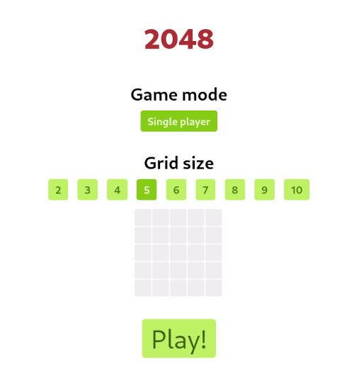
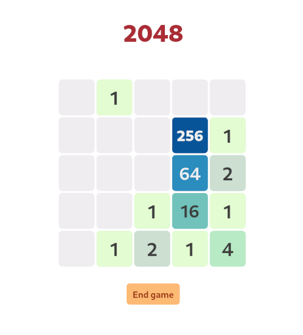

# 2048

This is a sliding tile puzzle game implemented in Elixir.

_#Elixir_ _#Phoenix_ _#LiveView_ _#SVG_


To start the game server for the first time, fetch mix dependencies and start
the Phoenix server:

```
$ mix deps.get
$ mix phx.server
```

Then navigate to http://localhost:4000.


## Single-player mode

Choose the grid size and click on the _Play!_ button to start the game.

<div>
  
  
</div>

The game continues until a tile with number 2048 is created, which means you
have won. The game is lost when no more free cells remain in grid and there are
no valid moves left.


## Multi-player mode

_Not yet implemented._


## Interactive shell mode

Launch the Elixir interactive shell with `iex -S mix` and start a local game session with `SN.start_local(<grid size>)`:

```
iex(1)> SN.start_local(4)
[0, 0, 0, 0]
[0, 0, 0, 0]
[0, 1, 0, 0]
[0, 0, 0, 0]
Enter a direction for the next move and press ENTER (r/l/u/d): r
[0, 0, 0, 0]
[0, 0, 0, 0]
[1, 0, 0, 1]
[0, 0, 0, 0]
Enter a direction for the next move and press ENTER (r/l/u/d): l
[0, 0, 1, 0]
[0, 0, 0, 0]
[2, 0, 0, 0]
[0, 0, 0, 0]
Enter a direction for the next move and press ENTER (r/l/u/d): u
[2, 0, 1, 0]
[0, 0, 0, 0]
[0, 0, 1, 0]
[0, 0, 0, 0]
Enter a direction for the next move and press ENTER (r/l/u/d): d
[0, 1, 0, 0]
[0, 0, 0, 0]
[0, 0, 0, 0]
[2, 0, 2, 0]
Enter a direction for the next move and press ENTER (r/l/u/d): l
[1, 1, 0, 0]
[0, 0, 0, 0]
[0, 0, 0, 0]
[4, 0, 0, 0]

...
```